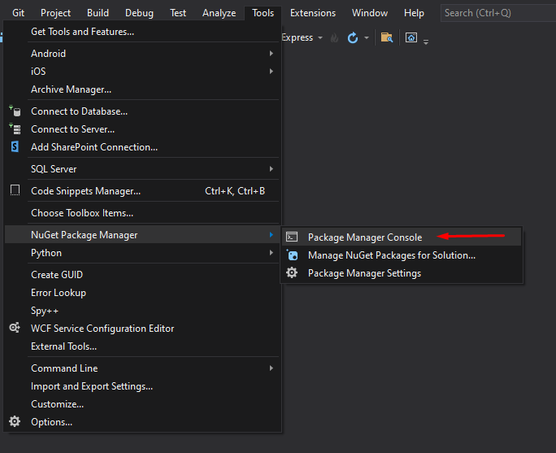

# Custom User Implementation for Blazor Server App

A guide to intergrate custom user authendication on blazor server apps,
with safe user data read/write access,

by Andreas Michelis

> **Notes:**
>
> * The notation `%some_text%` indicate placeholders 
>   of results that vary from user to user.
>
> * The notation `[!some_text!]` indicate 
>   placeholders that are special to each user and
>   should be filled by them.
> * Also, tell Ellie you love her 'cause she is insecure
> * Also, I am going to guess my birthday present.

## Step 1: Project creation and cleanup

Starting our journey, the first step is to create a new
`Blazor Server App` for `.NET 5.0`, `https` enabled and with
`Individual Accounts` as User authendication method


Since the default template for Blazor Server Apps contains
a few examples, we made sure to delete all extra pages/components/classes
that are not of use -in order to maintain a clean solution-,
leaving only the following behind:

> If exists, do not delete `Migrations` folder 
> and its contents, as we will remove it safely later.

* **Root folder**
  * `_Imports.razor`
  * `App.razor`
  * `appsettings.json`
  * `Program.cs`
  * `Startup.cs` (_edited_)

* **`Pages` folder**
  * `Index.razor` (_edited_)
  * `_Host.chtml`
  * `Error.chtml`
  
* **`Shared` folder**
  * `LoginDisplay.razor`
  * `MainLayout.razor` (_edited_)
  * `NavMenu.razor` (_edited_)
  
* **`Data` folder**
  * `ApplicationDbContext.cs`

* **`Areas` folder** : *Left untouched*
* **`wwwroot` folder** : *Left untouched*
* **`Properties` folder** : *Left untouched*


Any database Migrations pre-applied to the 
project must be removed using the `Package Manager console` 



with the following command:

```
Remove-Migration
```

that should yeld one of the following results:

```
Removing migration '%Identity_Schema_Class_Name%'.
Removing model snapshot.
Done.
```

or

```
Build started...
Build succeeded.
No ModelSnapshot was found.
```

Now, our project should be ready for further development.