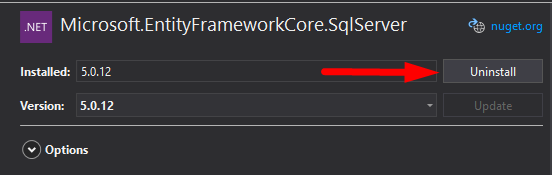

# Custom User Implementation for Blazor Server App

A guide to intergrate custom user authendication on blazor server apps,
with safe user data read/write access,

by Andreas Michelis

> **Notes:**
>
> * The notation `%some_text%` indicate placeholders 
>   of results that vary from user to user.
>
> * The notation `[!some_text!]` indicate 
>   placeholders that are special to each user and
>   should be filled by them.
> * Also, tell Ellie you love her 'cause she is insecure
> * Also, I am going to guess my birthday present.

## Step 1: Project creation and cleanup

Starting our journey, the first step is to create a new
`Blazor Server App` for `.NET 5.0`, `https` enabled and with
`Individual Accounts` as User authendication method


Since the default template for Blazor Server Apps contains
a few examples, we made sure to delete all extra pages/components/classes
that are not of use -in order to maintain a clean solution-,
leaving only the following behind:

> If exists, do not delete `Migrations` folder 
> and its contents, as we will remove it safely later.

* **Root folder**
  * `_Imports.razor`
  * `App.razor`
  * `appsettings.json`
  * `Program.cs`
  * `Startup.cs` (_edited_)

* **`Pages` folder**
  * `Index.razor` (_edited_)
  * `_Host.chtml`
  * `Error.chtml`
  
* **`Shared` folder**
  * `LoginDisplay.razor`
  * `MainLayout.razor` (_edited_)
  * `NavMenu.razor` (_edited_)
  
* **`Data` folder**
  * `ApplicationDbContext.cs`

* **`Areas` folder** : *Left untouched*
* **`wwwroot` folder** : *Left untouched*
* **`Properties` folder** : *Left untouched*


Any database Migrations pre-applied to the 
project must be removed using the `Package Manager console` 


with the following command:

```
Remove-Migration
```

that should yeld one of the following results:

```
Removing migration '%Identity_Schema_Class_Name%'.
Removing model snapshot.
Done.
```

or

```
Build started...
Build succeeded.
No ModelSnapshot was found.
```

Now, our project should be ready for further development.

## Step 2: PosgreSQL Intergration and User Secrets setup

Since our app has a user-base, we need to use a Database in 
order to manage user data. Microsoft provides multiple
database solution, from local to Azure cloud solutions.

### PostgreSQL

In order to have a robust yet flexible Database solution
with sufficient compatibility, we decided to use PostgreSQL
database, SINCE It's a free, well supported option that
can be "transplanted" on any device of our choice.

To do that, we removed the existing 
`Microsoft.EntityFrameworkCore.SqlServer` Nuget Package,
while adding `Npgsql.EntityFrameworkCore.PostgreSQL` and 
`Npgsql.EntityFrameworkCore.PostgreSQL.Design` 
(see images below)





Then, we changed `Startup.cs` to use PosgreSQL instead
of SqlServer

```csharp
/////////////////////////
// Before ///////////////
/////////////////////////
services.AddDbContext<ApplicationDbContext>(options =>
{
    options.UseSqlServer(Configuration.GetConnectionString("DefaultConnection"));
});

/////////////////////////
// After ////////////////
/////////////////////////
services.AddDbContext<ApplicationDbContext>(options =>
{
    options.UseNpgsql(Configuration.GetConnectionString("DefaultConnection"));
}
```

Lastly, on `appsettings.json`, we replace our _`DefaultConnection`_ 
string to point to our `PSQL` Server, from

```json
"ConnectionStrings": {
    "DefaultConnection": "Server=(localdb)\\mssqllocaldb;Database=aspnet-BrainstormArcive-AC6DE3B1-72DC-47D6-AE3C-CDA30871D5FB;Trusted_Connection=True;MultipleActiveResultSets=true"
},
```

to

```json
"ConnectionStrings": {
    "DefaultConnection": "Server=[!host!];Port=[!port!];Database=[!database!];User Id=[!user!];Password=[!password!];"
},
```

### User Secrets

If you're planning to create a project on your local machine
without ever publishing the code online, the use of `appsettings.json`
is sufficient enough. If, like this project, you're planning to distribute
the code through repositories or any other online means, you can
leverage the power of Visual Studio's "_User Secrets_".


Each Blazor App has a personal JSON "storage" that is located
withing user's `App Data` folder -away from the project-
and it's loaded automatically to the project. 
So, we stored our database credentials inside this file
and removed our connection string from `appsettings.json`
to keep it safe, offline but always available for development.

------

#### **`secrets.json`**
```json
{
  "Secrets": {
    "Database": {
      "Host":             "[!host!]",
      "Port":             "[!port!]",
      "Database":         "[!database!]",
      "User":             "[!user!]",
      "Password":         "[!password!]",
      "ConnectionString": "Server=[!host!];Port=[!port!];Database=[!database!];User Id=[!user!];Password=[!password!];"
    }
  }
}
```

------

#### **`appsettings.json`** 

**Before :**
```json
{
  "ConnectionStrings": {
    "DefaultConnection": "Server=[!host!];Port=[!port!];Database=[!database!];User Id=[!user!];Password=[!password!];"
  },
  "Logging": {
    "LogLevel": {
      "Default": "Information",
      "Microsoft": "Warning",
      "Microsoft.Hosting.Lifetime": "Information"
    }
  },
  "AllowedHosts": "*"
}
```

**After**
```json
{
  "Logging": {
    "LogLevel": {
      "Default": "Information",
      "Microsoft": "Warning",
      "Microsoft.Hosting.Lifetime": "Information"
    }
  },
  "AllowedHosts": "*"
}
```

------

#### **`Startup.sh`**

**Before :**
```csharp
services.AddDbContext<ApplicationDbContext>(options =>
{
    options.UseNpgsql(Configuration.GetConnectionString("DefaultConnection"));
}
```

**After**
```csharp
services.AddDbContext<ApplicationDbContext>(options =>
{
    options.UseNpgsql(Configuration["Secrets:Database:ConnectionString"]);
});
```

### Finally

Since everything on step 2 was successful, we confirmed connection
to our database by, once again using `Package Manager Console`
and typing 

```
PM> Add-Migration initial
-------------------------------------------
Build started...
Build succeeded.
To undo this action, use Remove-Migration.
```
```
PM> Update-Database
-------------------------------------------
Build started...
Build succeeded.
Done.
```